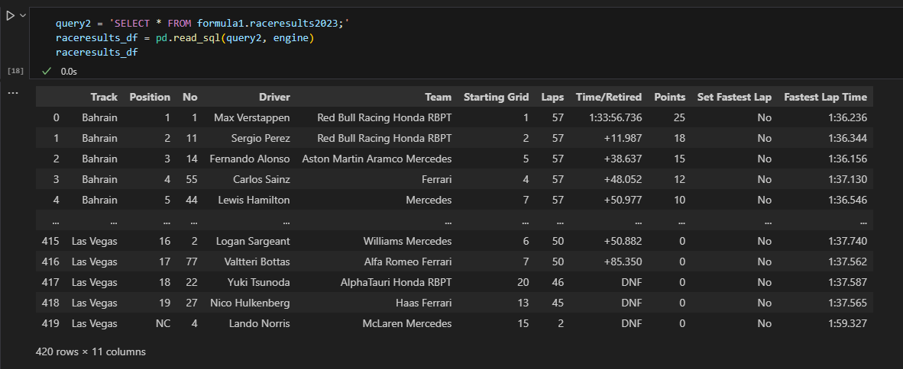

# Dashboards for Ferrari team: 2023 season results

## Summary

- Create virtual env
- Read data from PostgreSQL to Pandas dataframe
- Transfer data from PostgreSQL to Snowflake
- Connect dbt and Snowflake
- Build dbt data pipelines
- Establish data quality tests

## Create virtual env

```shell
pip install virtualenv
virtualenv f1dbt
f1dbt\Scripts\activate
```

## Read data from PostgreSQL to Pandas dataframe

I have 2 tables in PostgreSQL. To read it in Pandas dataframe - execute step 1 from [migration.ipynb](migration.ipynb)



## Transfer data from PostgreSQL to Snowflake

First of all we need to create database, scema and dbt user in Snowflake

```sql
-- Use an admin role
USE ROLE ACCOUNTADMIN;

-- Create the `transform` role
CREATE ROLE IF NOT EXISTS transform;
GRANT ROLE TRANSFORM TO ROLE ACCOUNTADMIN;

-- Create the default warehouse if necessary
CREATE WAREHOUSE IF NOT EXISTS COMPUTE_WH;
GRANT OPERATE ON WAREHOUSE COMPUTE_WH TO ROLE TRANSFORM;

-- Create the `dbt` user and assign to role
CREATE USER IF NOT EXISTS dbt
  PASSWORD='f1dbt'
  LOGIN_NAME='hannaf1'
  MUST_CHANGE_PASSWORD=FALSE
  DEFAULT_WAREHOUSE='COMPUTE_WH'
  DEFAULT_ROLE='transform'
  DEFAULT_NAMESPACE='F1.RAW'
  COMMENT='DBT user used for data transformation';
GRANT ROLE transform to USER dbt;

-- Create our database and schemas
CREATE DATABASE IF NOT EXISTS F1;
CREATE SCHEMA IF NOT EXISTS F1.RAW;

-- Set up permissions to role `transform`
GRANT ALL ON WAREHOUSE COMPUTE_WH TO ROLE transform;
GRANT ALL ON DATABASE F1 to ROLE transform;
GRANT ALL ON ALL SCHEMAS IN DATABASE F1 to ROLE transform;
GRANT ALL ON FUTURE SCHEMAS IN DATABASE F1 to ROLE transform;
GRANT ALL ON ALL TABLES IN SCHEMA F1.RAW to ROLE transform;
GRANT ALL ON FUTURE TABLES IN SCHEMA F1.RAW to ROLE transform;
```

To Migrate datasets from PostgreSQL to Snowflake - complete step 2 [migration.ipynb](migration.ipynb)

## Connect dbt and Snowflake

```shell
pip install dbt-snowflake==1.7.2
dbt init dbt_f1
```

- account: lkhpmcc-cn69015
- password: f1dbt
- role: transform
- warehouse: COMPUTE_WH
- database: F1
- schema: RAW
- threads: 1
- user: hannaf1 (in profiles.yml)

```shell
cd dbt_f1
dbt debug
```

## Build dbt data pipelines

Create separate folders for models to represent logical levels

```shel
mkdir models\staging
mkdir models\transform
mkdir models\mart
```

Modify dbt_project.yml file to reflect model structur. Staging layer will have view materialization, while transform and mart - table

```yaml
models:
  dbt_hol:
      # Applies to all files under models/example/
      staging:
          schema: staging
          materialized: view
      transform:
          schema: transform
          materialized: table
      mart:
          schema: mart
          materialized: mart
```

**- Staging layer.** In this layer I slightly modified [rresults](dbt_f1\models\staging\raw_rresults.sql) and [qresults](dbt_f1\models\staging\raw-qresults.sql) by making column names more meaningful. Executed `dbt run`.


**- Transformed layer.** In this step I changed data types for columns, replaced letter designations for drivers who didn't start/finish the race for 20 in points, null in time columns. Queries for [cleansed_rresults](dbt_f1\models\transform\cleansed_rresults.sql) and [cleansed_qresults](dbt_f1\models\transform\cleansed_qresults.sql). Executed `dbt run`.

**- Seeds.** Uploaded [reces orders](racesOrder2023.csv) to seeds folder. Seeds are usually small datasets in csv format (ex. catalogs). Executed `dbt seed`.

**- Mart layer.** This layer will be accessible for BI tools. I created two files [mart_rresults](dbt_f1\models\mart\mart_rresults.sql) and [mart_qresults](dbt_f1\models\mart\mart_qresults.sql), where join race order with transformed table.

## Running test

**- Generic tests.** In schema.yml added generic test 'not null' for track country and deriver number columns (cleansed_qresults and cleansed_rresults).

**- Singular tests.** In tests folder created files to check position columns for values (from 1 to 20).

## Analyses

In analyses folder created sql files to answer the questions:

- Average position of every racer during the championship; total points, the share of points contributed by the team's lead driver - [average_in_championship]
